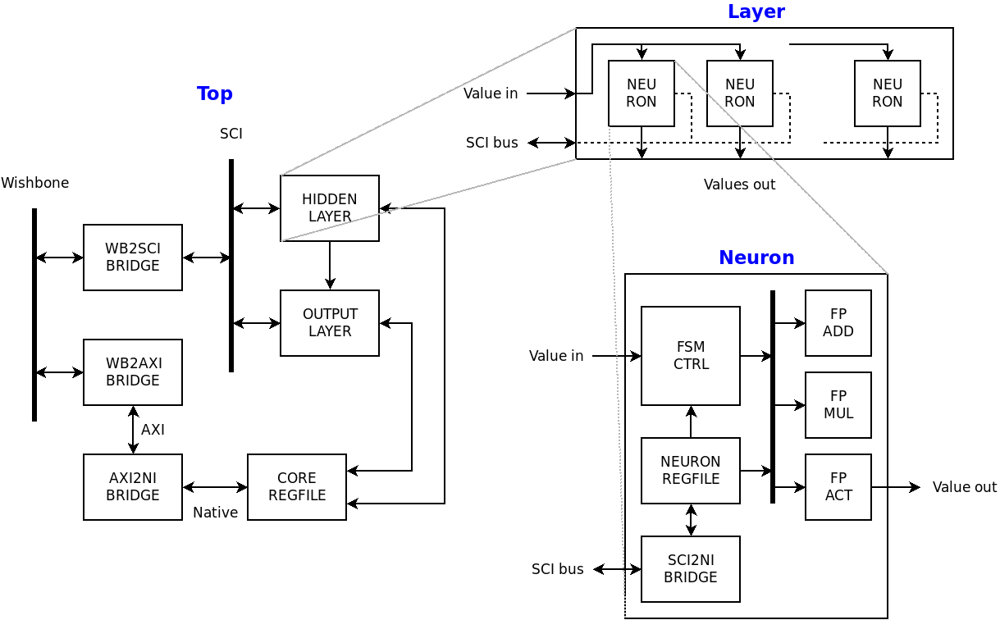
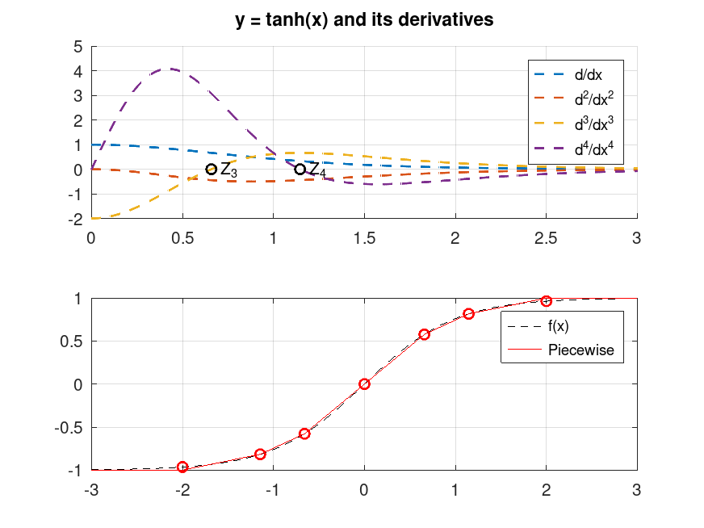

# Introduction
The CORTEZ repository contains design files and tools for the CORTEZ chip. This is a digital
implementation of a simple Neural Network for symbols recognition. The CORTEZ chip is meant to be
used as a testbed for MPW-driven ASICs.

## Overview
The CORTEZ design implements a simple neural network for pattern recognition of symbols laid out on
an input square noisy grid. It makes use of bipolar inputs and outputs, similar to the Madaline.
However, since the Madaline's activation function is non-differentiable and has a poor training
algorithm, this network makes us of a more general back-propagation algorithm. The activation
function is a piece-wise designed approximation of the hyperbolic tangent. The digital design is
based on fixed-point rather than floating-point to simplify the design and reduce area.

## Design versions
Different design versions solve different problems, called boulders. The following table reports the
available versions, the target shuttle and the implementation status. Design version matches the tag
within this repository.

| DESIGN VERSION | BOULDER | SHUTTLE | STATUS |
|-|-|-|-|
| `v1.0` | `o`, `u` and `i` recognition on a 3x3 grid | [GFMPW-1](https://repositories.efabless.com/scorbetta/CORTEZ1_GFMPW1) | Submitted |
| `v1.1` | `c` and `f` recognition on a 3x3 grid | None | Deprecated |
| `v1.2` | ACIC-tailored redesign | MPWXX | Work in progress |

# Design notes

## Introduction to version `v1.2`
The current version of the `CORTEZ` chip is specifically tailored to ASIC designs:
- The centralized `grogu` configuration instances has been replaced with multiple distributed
`grogu` instances; each neuron has its own minimal register file. This increases modules
independency, reducing the routing requirements;
- The configuration interface within each neuron is serial, instead of parallel. AXI4 Lite interface
has been replaced by the custom `SCI` interface (Scalable Configuration Interface). Wiring and area
are reduced tremendously. Routing congestion is reduced, for a better turnaround time;
- Accurate design partitioning and floorplan;
- Hierarchical design. Macros are used to isolate functionality, to simplify reuse and routing.
Macros at the same functional level share the same metal layers. Enclosing macros use an higher
metal layer.

| MACRO | BRIEF | FLOORPLAN | HIGHER METAL |
|-|-|-|-|
| `HL_NEURON` | Hidden layer neuron | 270umx270um | `met3` |
| `OL_NEURON` | Output layer neuron | 270umx270um | `met3` |
| `HIDDEN_LAYER` | Hidden layer w/ 24 neurons | 1900umx1300um | `met3` |
| `OUTPUT_LAYER` | Output layer w/ 5 neurons | 1600umx400um | `met3` |
| `CORE_REGFILE` | Core-level register file | 300umx1300um | `met3` |
| `CORE_TOP` | Top-level core (w/o Caravel harness) | 3000umx3000um | `met4` |

## Architecture
The simplified block diagram shows the CORTEZ top-level architecture, contents of each layer and
contents of each neuron.



## Scalable Configuration Interface
The `SCI` interface is an SPI-inspired serial interface for dense configurable designs. It is meant
for use in low-frequency register accesses, e.g. on-chip peripheral configuration registers or
status registers.

Compared to (one might say) classical approaches where a single register file centralizes
configuration and status information, SCI opts for a distributed methodology. Multiple configurable
blocks have their own local and confined register file. A serial interface then is used to access
them. The clocked interface consists of 4 signals plus the reference clock:

| SIGNAL | WIDTH | BRIEF |
|-|-|-|
| `CLK` | 1 | Reference clock |
| `CSN` | N | Active-low chip select |
| `REQ` | 1 | Request line (Master to Slave) |
| `RESP` | 1 | Read response line (Slave to Master) |
| `ACK` | 1 | Transfer ack and strobe line (Slave to Master) |

`N` is the number of peripherals attached to the Master block. `RESP` and `ACK` backward lines are
tri-stated. Access to the bus is allowed one peripheral at a time. It is the Master who selects
which peripheral can access the tri-state buffer through the `CSN` signal.

More information can be found in the `docs/SCI_*.*` files.

## Register files
There are multiple register files (distributed, refer to section on SCI): one for each neuron
containing configuration values (i.e., weights and bias for each input/neuron pair) and one
core-level space for configuration/status values that apply to either the network or the core.
Neuron-level register files sit on the SCI bus; core's, on the other hand, is based on a standard
AXI4 Lite interface.

All are managed through the `grogu` utility, and more additional information can be found in the
`grogu/grogu.gen/*/html` folders.

### Hidden layer registers
Hidden layer registers are 8-bit wide. SCI is word-addressable; the address corresponds to the
register index. Address is 6-bit wide.

| REGNAME | ADDRESS | CONTENTS |
|-|-|-|
| `WEIGHT_0` | 0x00 | Fixed-point weight for input 0 |
| `WEIGHT_1` | 0x01 | Fixed-point weight for input 1 |
| `WEIGHT_2` | 0x02 | Fixed-point weight for input 2 |
| `WEIGHT_3` | 0x03 | Fixed-point weight for input 3 |
| `WEIGHT_4` | 0x04 | Fixed-point weight for input 4 |
| `WEIGHT_5` | 0x05 | Fixed-point weight for input 5 |
| `WEIGHT_6` | 0x06 | Fixed-point weight for input 6 |
| `WEIGHT_7` | 0x07 | Fixed-point weight for input 7 |
| `WEIGHT_8` | 0x08 | Fixed-point weight for input 8 |
| `WEIGHT_9` | 0x09 | Fixed-point weight for input 9 |
| `WEIGHT_10` | 0x0a | Fixed-point weight for input 10 |
| `WEIGHT_11` | 0x0b | Fixed-point weight for input 11 |
| `WEIGHT_12` | 0x0c | Fixed-point weight for input 12 |
| `WEIGHT_13` | 0x0d | Fixed-point weight for input 13 |
| `WEIGHT_14` | 0x0e | Fixed-point weight for input 14 |
| `WEIGHT_15` | 0x0f | Fixed-point weight for input 15 |
| `WEIGHT_16` | 0x10 | Fixed-point weight for input 16 |
| `WEIGHT_17` | 0x11 | Fixed-point weight for input 17 |
| `WEIGHT_18` | 0x12 | Fixed-point weight for input 18 |
| `WEIGHT_19` | 0x13 | Fixed-point weight for input 19 |
| `WEIGHT_20` | 0x14 | Fixed-point weight for input 20 |
| `WEIGHT_21` | 0x15 | Fixed-point weight for input 21 |
| `WEIGHT_22` | 0x16 | Fixed-point weight for input 22 |
| `WEIGHT_23` | 0x17 | Fixed-point weight for input 23 |
| `WEIGHT_24` | 0x18 | Fixed-point weight for input 24 |
| `WEIGHT_25` | 0x19 | Fixed-point weight for input 25 |
| `WEIGHT_26` | 0x1a | Fixed-point weight for input 26 |
| `WEIGHT_27` | 0x1b | Fixed-point weight for input 27 |
| `WEIGHT_28` | 0x1c | Fixed-point weight for input 28 |
| `WEIGHT_29` | 0x1d | Fixed-point weight for input 29 |
| `WEIGHT_30` | 0x1e | Fixed-point weight for input 30 |
| `WEIGHT_31` | 0x1f | Fixed-point weight for input 31 |
| `WEIGHT_32` | 0x20 | Fixed-point weight for input 32 |
| `WEIGHT_33` | 0x21 | Fixed-point weight for input 33 |
| `WEIGHT_34` | 0x22 | Fixed-point weight for input 34 |
| `WEIGHT_35` | 0x23 | Fixed-point weight for input 35 |
| `BIAS` | 0x10 | Fixed-point bias |

### Output layer registers
Output layer registers are 8-bit wide. SCI is word-addressable; the address corresponds to the
register index. Address is 4-bit wide.

| REGNAME | ADDRESS | CONTENTS |
|-|-|-|
| `WEIGHT_0` | 0x0 | Fixed-point weight for input 0 |
| `WEIGHT_1` | 0x1 | Fixed-point weight for input 1 |
| `WEIGHT_2` | 0x2 | Fixed-point weight for input 2 |
| `WEIGHT_3` | 0x3 | Fixed-point weight for input 3 |
| `WEIGHT_4` | 0x4 | Fixed-point weight for input 4 |
| `WEIGHT_5` | 0x5 | Fixed-point weight for input 5 |
| `WEIGHT_6` | 0x6 | Fixed-point weight for input 6 |
| `WEIGHT_7` | 0x7 | Fixed-point weight for input 7 |
| `BIAS` | 0x8 | Fixed-point bias |

### Core registers
Core registers are 8-bit wide. AXI4 Lite is Byte-addressable; the address still corresponds to the
register index since registers are 1-Byte wide. Address is 6-bit wide.

| REGNAME | ADDRESS | CONTENTS |
|-|-|-|
| `DBUG_REG_0` | 0x00 | Debug register |
| `DBUG_REG_1` | 0x01 | Debug register |
| `DBUG_REG_2` | 0x02 | Debug register |
| `DBUG_REG_3` | 0x03 | Debug register |
| `INPUT_GRID_0` | 0x04 | Input value for grid cell 0 |
| `INPUT_GRID_1` | 0x05 | Input value for grid cell 1 |
| `INPUT_GRID_2` | 0x06 | Input value for grid cell 2 |
| `INPUT_GRID_3` | 0x07 | Input value for grid cell 3 |
| `INPUT_GRID_4` | 0x08 | Input value for grid cell 4 |
| `INPUT_GRID_5` | 0x09 | Input value for grid cell 5 |
| `INPUT_GRID_6` | 0x0a | Input value for grid cell 6 |
| `INPUT_GRID_7` | 0x0b | Input value for grid cell 7 |
| `INPUT_GRID_8` | 0x0c | Input value for grid cell 8 |
| `INPUT_GRID_9` | 0x0d | Input value for grid cell 9 |
| `INPUT_GRID_10` | 0x0e | Input value for grid cell 10 |
| `INPUT_GRID_11` | 0x0f | Input value for grid cell 11 |
| `INPUT_GRID_12` | 0x10 | Input value for grid cell 12 |
| `INPUT_GRID_13` | 0x11 | Input value for grid cell 13 |
| `INPUT_GRID_14` | 0x12 | Input value for grid cell 14 |
| `INPUT_GRID_15` | 0x13 | Input value for grid cell 15 |
| `INPUT_GRID_16` | 0x14 | Input value for grid cell 16 |
| `INPUT_GRID_17` | 0x15 | Input value for grid cell 17 |
| `INPUT_GRID_18` | 0x16 | Input value for grid cell 18 |
| `INPUT_GRID_19` | 0x17 | Input value for grid cell 19 |
| `INPUT_GRID_20` | 0x18 | Input value for grid cell 20 |
| `INPUT_GRID_21` | 0x19 | Input value for grid cell 21 |
| `INPUT_GRID_22` | 0x1a | Input value for grid cell 22 |
| `INPUT_GRID_23` | 0x1b | Input value for grid cell 23 |
| `INPUT_GRID_24` | 0x1c | Input value for grid cell 24 |
| `INPUT_GRID_25` | 0x1d | Input value for grid cell 25 |
| `INPUT_GRID_26` | 0x1e | Input value for grid cell 26 |
| `INPUT_GRID_27` | 0x1f | Input value for grid cell 27 |
| `INPUT_GRID_28` | 0x20 | Input value for grid cell 28 |
| `INPUT_GRID_29` | 0x21 | Input value for grid cell 29 |
| `INPUT_GRID_30` | 0x22 | Input value for grid cell 30 |
| `INPUT_GRID_31` | 0x23 | Input value for grid cell 31 |
| `INPUT_GRID_32` | 0x24 | Input value for grid cell 32 |
| `INPUT_GRID_33` | 0x25 | Input value for grid cell 33 |
| `INPUT_GRID_34` | 0x26 | Input value for grid cell 34 |
| `INPUT_GRID_35` | 0x27 | Input value for grid cell 35 |
| `OUTPUT_SOLUTION_0` | 0x28 | Output solution, one-hot |
| `OUTPUT_SOLUTION_1` | 0x29 | Output solution, one-hot |
| `OUTPUT_SOLUTION_2` | 0x2a | Output solution, one-hot |
| `OUTPUT_SOLUTION_3` | 0x2b | Output solution, one-hot |
| `OUTPUT_SOLUTION_4` | 0x2c | Output solution, one-hot |
| `CORE_CTRL` | 0x2d | Core control register |
| `CORE_DEBUG_INFO` | 0x2e | Core debug register |
| `CORE_STATUS` | 0x2f | Core status register |
| `SEVENSEG_0` | 0x30 | Contents to drive 7-segments display 0 |
| `SEVENSEG_1` | 0x31 | Contents to drive 7-segments display 1 |
| `SEVENSEG_2` | 0x32 | Contents to drive 7-segments display 2 |
| `SEVENSEG_3` | 0x33 | Contents to drive 7-segments display 3 |

## Piecewise approximation of `tanh()`
The selected activation function `tanh()` is being replaced by its piecewise approximation function.
This reduced area requirements and simplifies implementation. Linear interpolation between
successive points is carefully chosen to minimize the error. The points where the `tanh()` function
is split are chosen by looking at up to the 4-th derivative. Since the `tanh()` function is odd
symmetric, the digital implementation focuses on half of the problem in the 1st quadrant. The other
half of the problem on the 3rd quadrant is derived. The output is shown.



## Firmware initialization
TBD

# Repository contents
- `grogu/`, register map design files based on [`grogu`](https://github.com/scorbetta/grogu);
- `model/neural_network/`, the Python model of the neural network;
- `model/piecewise_approximation/`, the Python and Matlab files of the `tanh()` approximation;
- `rtl/`, the RTL design;
- `sim/`, out-of-the-box-testbench for bring-up simulation;
- `ver/`, the verification environment;
- `generate_design.sh`, the main script to run the design customization flow.

# How-to: design customization
The `generate_design.sh` script can be used to run the network customization flow from model to RTL.
The script will run through the following steps:

- Model training;
- Model testing;
- Piecewise approximation generation;
- Top-level RTL design generation;
- Simple simulation.

Before running the flow, open `generate_design.sh` and modify the following constants according to
your desired network architecture and input problem:

| CONSTANT | BRIEF |
|-|-|
| `HL_NEURONS` | Number of neurons in the hidden layer |
| `OL_NEURONS` | Number of neurons in the output layer |
| `FP_WIDTH` | Fixed-point width |
| `FP_FRAC` | Fixed-point fractional portion |
| `GRID_SIZE` | Input problem size (one dimension) |
| `MAX_NOISY_PIXELS` | Number of noisy pixels to use for training |
| `TRAINING_LEN` | Number of training vectors |
| `TEST_LEN` | Number of test vectors |
| `EPOCHS` | Number of training epochs |
| `ALPHA` | Learning rate |

At this point, run the flow:

```bash
./generate_design.sh
```

Logs are created for each step, look for any `*.log` file in the subfolders.

# Verification environment
Verification is based [`cocotb`](https://www.cocotb.org/), with the `ver/` folder containining
scripts and Makefiles to run module-based and regression runs.

Some of the components are reused from the [`rdnv`](https://github.com/scorbetta/rdnv) repository;
for those components, verification is assumed. For all other modules, verification is run using the
configuration implied by the currently available trained network result. This means network
configuration and fixed-point configuration is taken from the
`model/neural_network/trained_network/config.ini` file.
